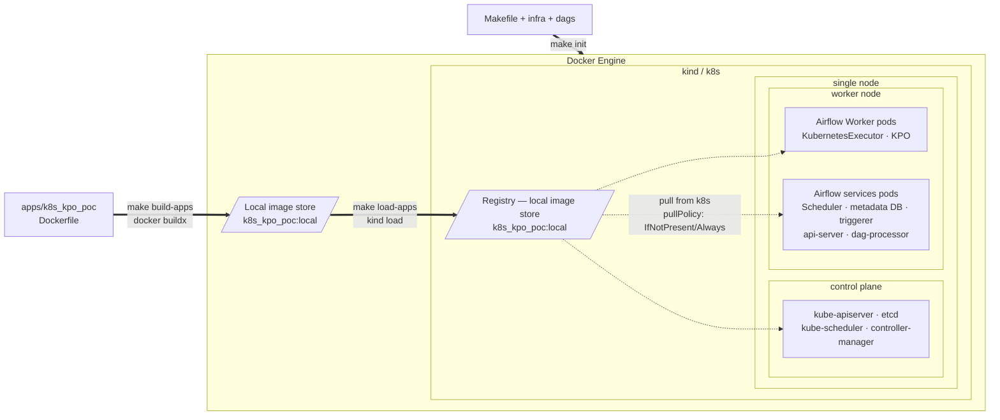
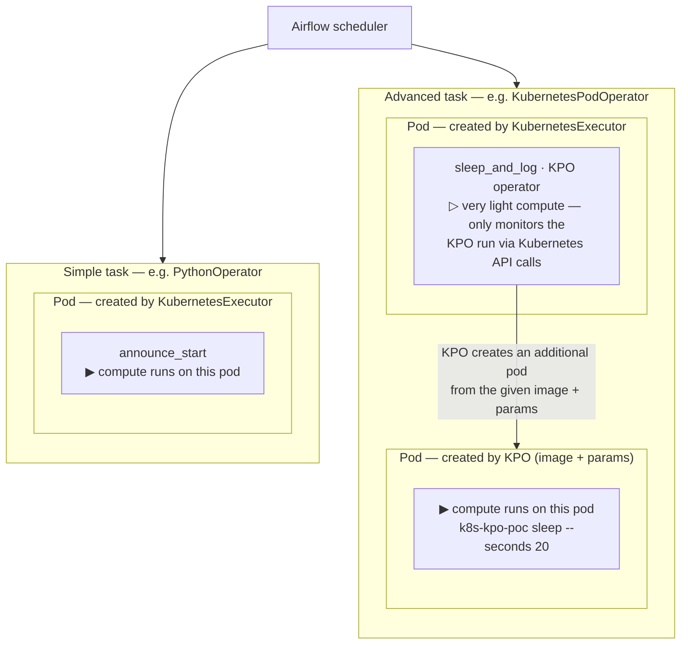
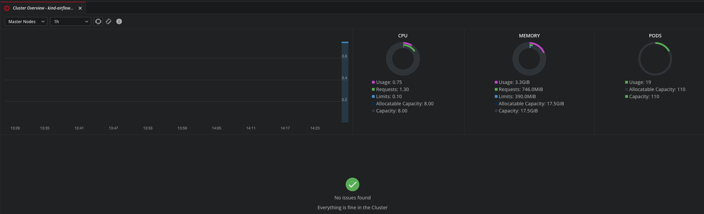
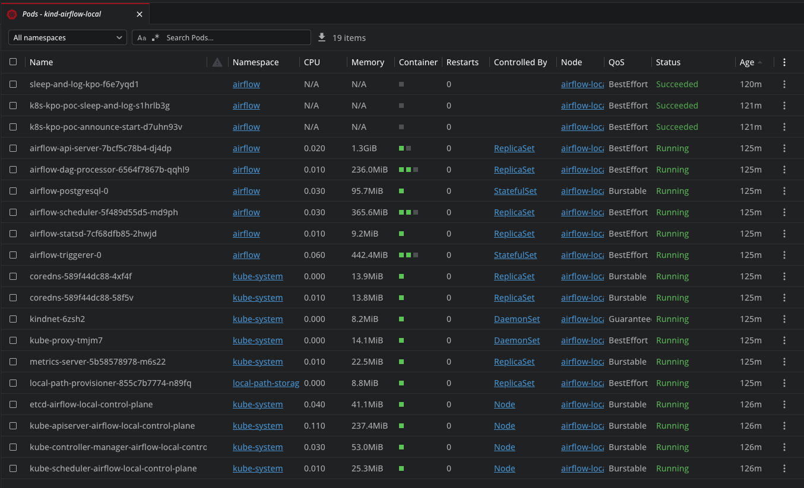
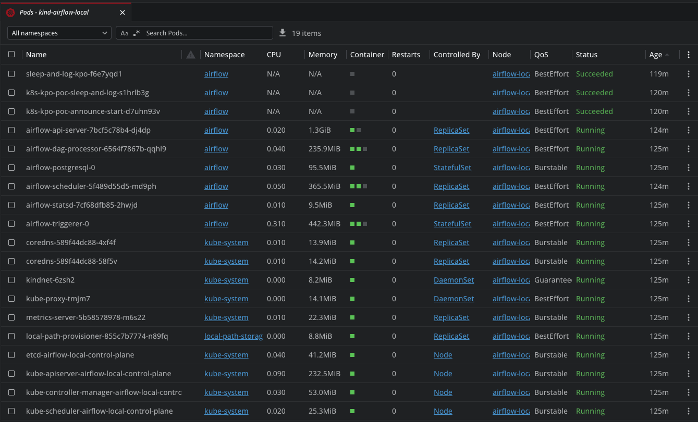
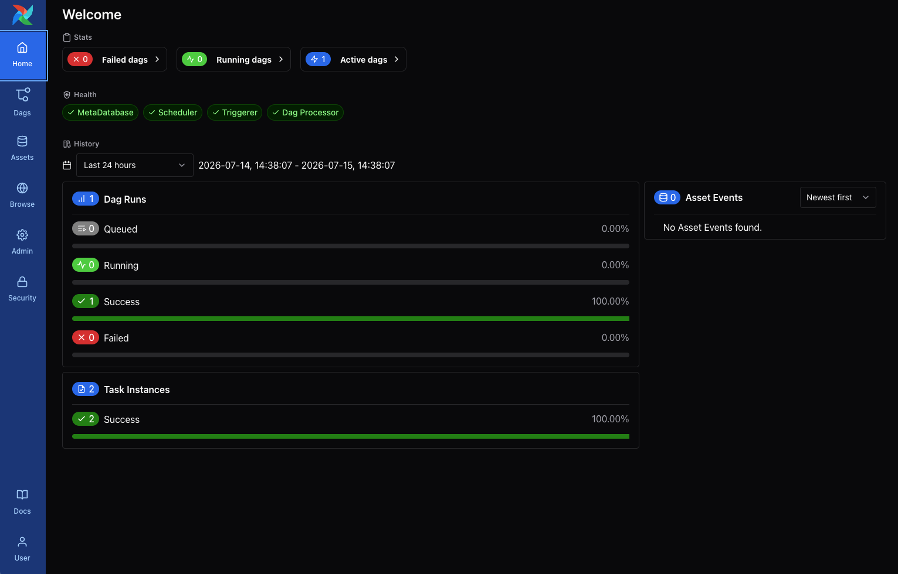
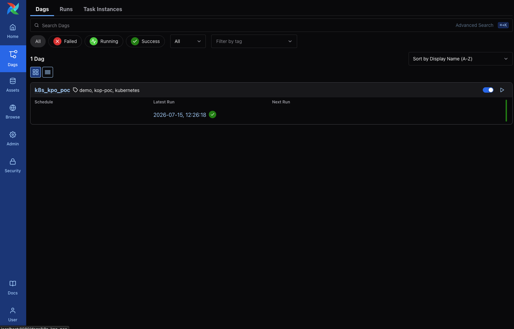
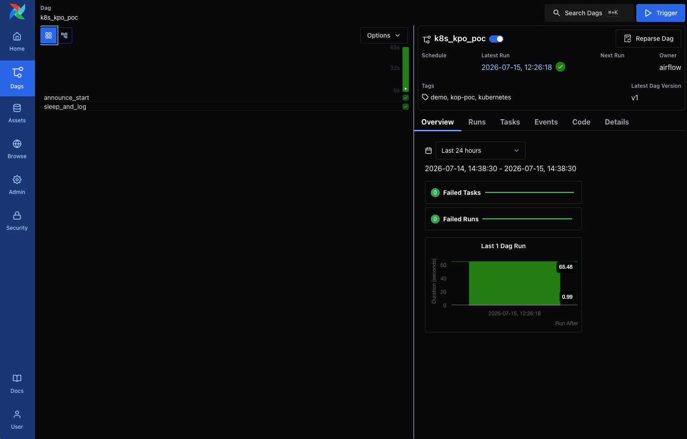
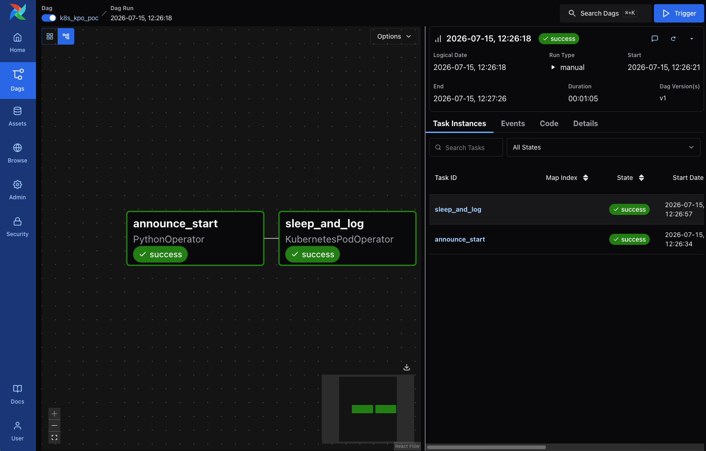
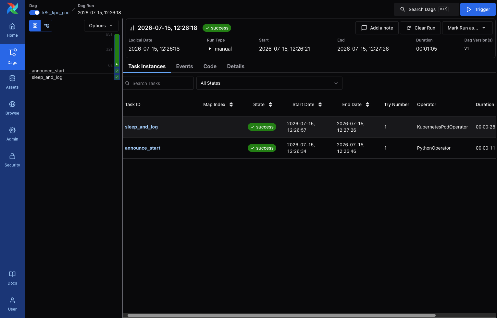

# airflow-k8s-poc

A local proof-of-concept running Apache Airflow on Kubernetes (kind) that demonstrates the
**KubernetesExecutor** together with the **KubernetesPodOperator (KPO)** to orchestrate a
containerized dummy Python (Typer) CLI application.

> Deployed with **[Apache Airflow 3.2.2](https://airflow.apache.org/docs/apache-airflow/3.2.2/)**, the
> **[cncf-kubernetes provider 10.19.0](https://airflow.apache.org/docs/apache-airflow-providers-cncf-kubernetes/10.19.0/index.html)**,
> via the official
> **[Apache Airflow Helm chart 1.22.0](https://artifacthub.io/packages/helm/apache-airflow/airflow/1.22.0)**.
> The chart's default values for this version are in
> [`chart/values.yaml`](https://github.com/apache/airflow/blob/helm-chart/1.22.0/chart/values.yaml).

## Author's Note — Agentic Engineering

This repository is a personal proof-of-concept in **agentic engineering**, privately owned by me: I
designed and directed it end to end, and AI (OpenAI Codex) acted only as an implementer, turning my
specifications into code.

**What I own — the engineering:**

- **Direction & design** — I drove the project and defined its architecture and repository/folder
  structure.
- **Separation of concerns** — I designed the decoupling between the *business logic* (a
  containerized Python "dummy" CLI application) and the *orchestration layer* (Airflow DAGs), so
  compute and scheduling evolve independently.
- **A repeatable pattern** — I structured the workflow so any number of CLI applications are built,
  packaged, and orchestrated exactly the way the current one is.
- **Right tool for the CLI layer** — I built the CLI applications with
  [Typer](https://typer.tiangolo.com/), which provides the generic CLI concerns (argument parsing,
  subcommands, `--help`, validation) out of the box, so each app carries only its business logic
  instead of reinventing the plumbing.
- **Modern, pinned, reproducible tooling** — left to its defaults, AI tends to emit dated,
  inconsistent setups (e.g. Python 3.10 in the Dockerfile but a different version in
  `pyproject.toml`, and `pip` as the package manager). I required a single consistent toolchain —
  [`uv`](https://docs.astral.sh/uv/) with `pyproject.toml`, Python 3.14.6 in both the project and the
  container image — with every
  version explicitly pinned (exact `==` matches in `pyproject.toml`, never `latest` or a version
  range) and checked as the latest at the time of writing. Together with the committed lockfile
  (`uv.lock`), this keeps builds **reproducible over time**: the same inputs still resolve and build
  identically months later, not just today.
- **Production-like realism** — I simulated a production workload by running the stack on Kubernetes.
- **Deliberate PoC trade-offs** — I wanted an environment I could iterate on in seconds, not
  minutes, without weakening security. Everything runs locally on `kind`: nothing is exposed
  publicly on the Internet, there is no heavy preliminary setup to stand up (IAM, KMS, IaC, cloud
  accounts, load balancers, networking, managed RDS), and no slow change cycles to wait on
  (`terraform apply`, EKS cluster create/delete, RDS create/delete). I leaned on Helm and Bash for
  simplicity while keeping full control over core Airflow and Kubernetes settings.

**The agent's role:** implement to spec — following my descriptions and specifications to produce
the code, manifests, and documentation. The architecture, decomposition, and trade-offs are mine.

## What this PoC demonstrates

- **KubernetesExecutor** — every Airflow task runs in its own ephemeral worker pod instead of a
  long-lived worker. Configured in [`infra/values/airflow.yaml`](infra/values/airflow.yaml).
- **KubernetesPodOperator (KPO)** — a task additionally spins up a *dedicated* pod that runs a
  purpose-built container image, decoupling the task's runtime and dependencies from Airflow.
- **Dummy Python CLI application** — [`apps/k8s_kpo_poc`](apps/k8s_kpo_poc/README.md), a
  [Typer](https://typer.tiangolo.com/) CLI (`k8s-kpo-poc`) packaged as a Docker image
  (`k8s_kpo_poc:local`) and invoked as the KPO workload. Commands: `hello`, `sleep`,
  `product sample`.
- **Sample DAG** — [`dags/k8s_kpo_poc.py`](dags/k8s_kpo_poc.py) chains a `PythonOperator`
  (`announce_start`, no pod) into a `KubernetesPodOperator` (`sleep_and_log`) that runs
  `k8s-kpo-poc sleep --seconds 20` in its own pod.

## Architecture

Two views of the same PoC: the **infrastructure layering** (where everything physically runs) and
the **execution model** (how a DAG run maps onto Kubernetes).

### Infrastructure



The whole stack runs inside a single Docker Engine (via Colima). Docker Engine holds two zones: its
own **local image store** and the **kind / k8s** zone — which itself holds a **registry** (a local
image store the node pulls from) and the cluster's **single node**. That node splits into a
**control plane** and a **worker node** where the pods run: the Airflow **worker pods**
(KubernetesExecutor · KPO) next to the Airflow **service pods** (scheduler, metadata DB, triggerer,
api-server, dag-processor). `make build-apps` (`docker buildx`) builds the app image into the Docker
Engine store; `make load-apps` (`kind load`) copies it from there into the kind registry. Nothing is
exposed to the Internet.

**Image pull policy (chart defaults).** The cluster relies on the chart defaults. The ephemeral
**worker pods** the KubernetesExecutor creates to run tasks follow
[`images.pod_template.pullPolicy`](https://github.com/apache/airflow/blob/helm-chart/1.22.0/chart/values.yaml#L98)
(default `IfNotPresent`), so a worker pod reuses the image already loaded into the node instead of
re-pulling it. The long-running Airflow components (scheduler, api-server, triggerer, dag-processor)
follow
[`images.airflow.pullPolicy`](https://github.com/apache/airflow/blob/helm-chart/1.22.0/chart/values.yaml#L83)
(also `IfNotPresent`). The pod a **KubernetesPodOperator** launches is governed by neither field — its
pull policy comes from the operator's `image_pull_policy` argument in the DAG (Kubernetes default:
`Always` for `:latest`/untagged images, `IfNotPresent` otherwise).

### Execution model



With the **KubernetesExecutor**, Airflow runs every task in a dedicated pod it creates on the fly
(by default all these pods share the same configuration and base image). A **Simple task**
(`PythonOperator`, `announce_start`) does its compute directly on that pod. An **Advanced task**
(`KubernetesPodOperator`, `sleep_and_log`) gets its executor pod the same way, but that pod carries
only very light compute — it just monitors the run through Kubernetes API calls — while KPO creates
an **additional pod** from the supplied image and parameters, and the real compute happens there.

## Repository layout

| Path | Description |
| --- | --- |
| [`apps/k8s_kpo_poc/`](apps/k8s_kpo_poc/README.md) | Dummy Typer CLI app used as the KPO workload (own SDLC, Dockerfile, tests). |
| [`dags/`](dags) | Airflow DAGs, mounted into the cluster and exposed at `/opt/airflow/dags`. |
| [`infra/`](infra/README.md) | kind cluster config, Helm values and Kubernetes manifests for Airflow. |
| `Makefile` | One-command lifecycle: `init`, `build-apps`, `load-apps`, `run`, `destroy`. |

## Prerequisites (host tools)

> This project is optimized for **macOS 26.2 (arm64)**. It needs only very light changes to run
> cross-platform — mainly adapting the `colima` commands (e.g. using Docker Desktop or a native
> Linux Docker daemon in place of Colima).

| Tool | Version | Description | Install (Homebrew) |
| --- | --- | --- | --- |
| Colima | 0.10.3 | Docker-runtime VM hosting the Docker daemon on macOS | `brew install colima` |
| Docker Engine | 29.5.2 | Docker client, daemon & Compose (run through Colima) | `brew install docker` |
| Docker Buildx | latest | Multi-platform image builder | `brew install docker-buildx` |
| kind | 0.31.0 | Local Kubernetes running inside Docker | `brew install kind` |
| kubectl | 1.35 | Kubernetes CLI | `brew install kubectl` |
| Helm | latest | Kubernetes package manager (Airflow chart) | `brew install helm` |
| uv | 0.11.29 | Python toolchain & dependency manager | `brew install uv` |
| Python | OS native | System interpreter — the project Python is managed by `uv` (see note) | — |

> **Python version:** `uv` doubles as the Python version manager — it automatically installs the
> project-specific Python pinned in [`apps/k8s_kpo_poc/pyproject.toml`](apps/k8s_kpo_poc/pyproject.toml)
> (currently **3.14.6**). No manual Python install is required; the host only needs its OS-native Python.

### Colima quick start (if not using Docker Desktop)
```bash
brew install colima docker docker-buildx
colima start --cpu 4 --memory 8 --disk 60
docker context use colima
docker buildx create --name colima-builder --driver docker-container --use
docker buildx inspect --bootstrap
```

### Verify buildx
```bash
docker buildx version
docker buildx ls
```

## Getting started

1. Set up the local Airflow cluster and build/load the app image to the k8s cluster (kind)
```bash
make init && make build-apps && make load-apps
```

2. Launch the local Airflow stack (port-forwards the UI to `localhost:8080`)
```bash
make run
```

3. Trigger the PoC: from the Airflow UI, run the `k8s_kpo_poc` DAG, then watch the
   `KubernetesPodOperator` pod appear and complete
```bash
kubectl -n airflow get pods -w   # or: make status
```

4. Clean up all resources
```bash
make destroy && docker system prune -a --volumes && colima delete
```

## Screenshots

### Infrastructure

Once the local Airflow cluster is running, you can inspect it with a CLI client such as
**[k9s](https://github.com/derailed/k9s)**, or a graphical client such as **[Lens](https://lenshq.io/)**
(recommended). The screenshots below show the running cluster inspected with Lens.


*Cluster overview*


*Workloads overview*


*Airflow pods*

### Application

The Airflow web UI exposes the orchestration layer — the `k8s_kpo_poc` DAG and its runs.


*Airflow home*


*DAGs list*


*`k8s_kpo_poc` — DAG overview*


*`k8s_kpo_poc` — task graph*


*`k8s_kpo_poc` — task instances*

## Running the CLI standalone

The dummy app can also be exercised outside Airflow — see
[`apps/k8s_kpo_poc/README.md`](apps/k8s_kpo_poc/README.md):

```bash
uv run --project apps/k8s_kpo_poc k8s-kpo-poc hello
uv run --project apps/k8s_kpo_poc k8s-kpo-poc sleep --seconds 10
```
