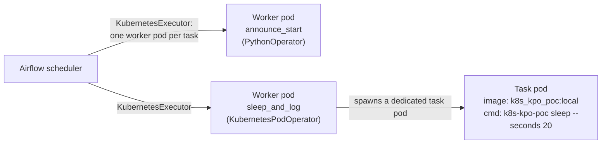

# airflow-k8s-poc

A local proof-of-concept running Apache Airflow on Kubernetes (kind) that demonstrates the
**KubernetesExecutor** together with the **KubernetesPodOperator (KPO)** to orchestrate a
containerized dummy Python (Typer) CLI application.

> Deployed with **[Apache Airflow 3.0.2](https://airflow.apache.org/docs/apache-airflow/3.0.2/)** via the official
> **[Apache Airflow Helm chart 1.18.0](https://artifacthub.io/packages/helm/apache-airflow/airflow/1.18.0)**.

## What this PoC demonstrates

- **KubernetesExecutor** — every Airflow task runs in its own ephemeral worker pod instead of a
  long-lived worker. Configured in [`infra/values/airflow.yaml`](infra/values/airflow.yaml).
- **KubernetesPodOperator (KPO)** — a task additionally spins up a *dedicated* pod that runs a
  purpose-built container image, decoupling the task's runtime and dependencies from Airflow.
- **Dummy Python CLI application** — [`apps/k8s_kpo_poc`](apps/k8s_kpo_poc/README.md), a
  [Typer](https://typer.tiangolo.com/) CLI (`k8s-kpo-poc`) packaged as a Docker image
  (`k8s_kpo_poc:local`) and invoked as the KPO workload. Commands: `hello`, `sleep`,
  `product sample`.
- **Sample DAG** — [`dags/k8s_kpo_poc.py`](dags/k8s_kpo_poc.py) chains a `PythonOperator`
  (`announce_start`, no pod) into a `KubernetesPodOperator` (`sleep_and_log`) that runs
  `k8s-kpo-poc sleep --seconds 20` in its own pod.

### Execution model



## Repository layout

| Path | Description |
| --- | --- |
| [`apps/k8s_kpo_poc/`](apps/k8s_kpo_poc/README.md) | Dummy Typer CLI app used as the KPO workload (own SDLC, Dockerfile, tests). |
| [`dags/`](dags) | Airflow DAGs, mounted into the cluster and exposed at `/opt/airflow/dags`. |
| [`infra/`](infra/README.md) | kind cluster config, Helm values and Kubernetes manifests for Airflow. |
| `Makefile` | One-command lifecycle: `init`, `build-apps`, `load-apps`, `run`, `destroy`. |

## Prerequisites (host tools)

> This project is optimized for **macOS 26.2 (arm64)**. It needs only very light changes to run
> cross-platform — mainly adapting the `colima` commands (e.g. using Docker Desktop or a native
> Linux Docker daemon in place of Colima).

| Tool | Version | Description | Install (Homebrew) |
| --- | --- | --- | --- |
| Colima | 0.10.3 | Docker-runtime VM hosting the Docker daemon on macOS | `brew install colima` |
| Docker Engine | 29.5.2 | Docker client, daemon & Compose (run through Colima) | `brew install docker` |
| Docker Buildx | latest | Multi-platform image builder | `brew install docker-buildx` |
| kind | 0.31.0 | Local Kubernetes running inside Docker | `brew install kind` |
| kubectl | 1.35 | Kubernetes CLI | `brew install kubectl` |
| Helm | latest | Kubernetes package manager (Airflow chart) | `brew install helm` |
| uv | 0.9.29 | Python toolchain & dependency manager | `brew install uv` |
| Python | OS native | System interpreter — the project Python is managed by `uv` (see note) | — |

> **Python version:** `uv` doubles as the Python version manager — it automatically installs the
> project-specific Python pinned in [`apps/k8s_kpo_poc/pyproject.toml`](apps/k8s_kpo_poc/pyproject.toml)
> (currently **3.14.2**). No manual Python install is required; the host only needs its OS-native Python.

### Colima quick start (if not using Docker Desktop)
```bash
brew install colima docker docker-buildx
colima start --cpu 4 --memory 8 --disk 60
docker context use colima
docker buildx create --name colima-builder --driver docker-container --use
docker buildx inspect --bootstrap
```

### Verify buildx
```bash
docker buildx version
docker buildx ls
```

## Getting started

1. Set up the local Airflow cluster and build/load the app image to the k8s cluster (kind)
```bash
make init && make build-apps && make load-apps
```

2. Launch the local Airflow stack (port-forwards the UI to `localhost:8080`)
```bash
make run
```

3. Trigger the PoC: from the Airflow UI, run the `k8s_kpo_poc` DAG, then watch the
   `KubernetesPodOperator` pod appear and complete
```bash
kubectl -n airflow get pods -w   # or: make status
```

4. Clean up all resources
```bash
make destroy && docker system prune -a --volumes && colima delete
```

## Inspecting the cluster

Once the local Airflow cluster is running, you can interact with it using a CLI client such as
**[k9s](https://github.com/derailed/k9s)**, or a graphical client such as **[Lens](https://lenshq.io/)**
(recommended). The screenshots below show the running cluster inspected with Lens.


*Cluster overview*


*Workloads overview*


*Airflow pods*

## Running the CLI standalone

The dummy app can also be exercised outside Airflow — see
[`apps/k8s_kpo_poc/README.md`](apps/k8s_kpo_poc/README.md):

```bash
uv run --project apps/k8s_kpo_poc k8s-kpo-poc hello
uv run --project apps/k8s_kpo_poc k8s-kpo-poc sleep --seconds 10
```
