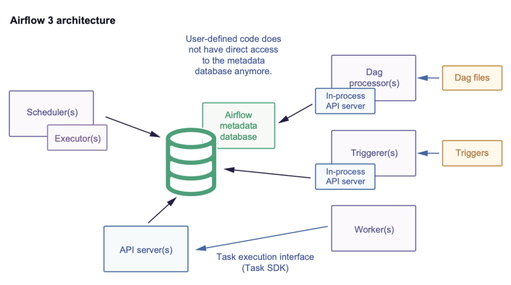

# 01 — Airflow core concepts

## Overview

Apache Airflow is an open-source platform to develop, schedule, and monitor **batch-oriented
workflows**. Workflows are authored in Python — the *"workflows as code"* approach — which makes them:

- **Dynamic** — pipelines are defined in code, so DAGs can be generated and parameterized programmatically.
- **Extensible** — a broad catalog of built-in operators, extendable to fit any need.
- **Flexible** — the Jinja templating engine allows rich, reusable customizations.

Each workflow is a **DAG** (Directed Acyclic Graph): a set of **Tasks** wired together with
dependencies that define their execution order. A task describes *what to do* — fetch data, run an
analysis, trigger another system. Airflow itself is agnostic to what a task runs; it orchestrates
anything, either through a provider integration or directly via a shell or Python command.

### When Airflow is a good fit

Workflows that have a clear start and end and run on a schedule are a natural fit. Airflow's rich
scheduling and execution semantics make complex, recurring pipelines easy to express: trigger DAGs
manually, inspect logs, monitor task status, **backfill** historical runs, or rerun only the failed
tasks to save time and cost.

### When Airflow is not the right tool

Airflow is **not** built for continuously running, event-driven, or streaming workloads. It does,
however, complement streaming systems well: a tool like Apache Kafka handles real-time ingestion into
storage, and Airflow periodically picks that data up and processes it in **batch**.

## Architecture

A workflow is a DAG containing individual units of work (Tasks) arranged by dependencies and data
flows. The DAG defines the order; the tasks define the work. An **Operator** is a reusable template
for a task — much like a framework, it packages ready-made task logic (for example, manipulating S3
objects or handling SQS queues) so you don't reimplement it yourself.

*Apache Airflow 3 architecture. Source: [Apache Airflow documentation — Upgrading to Airflow 3](https://airflow.apache.org/docs/apache-airflow/3.2.2/installation/upgrading_to_airflow3.html#airflow-3-x-architecture).*

### Minimal required components

- **Scheduler** — triggers scheduled workflows and submits tasks to the executor. The **executor** is
  a configuration property of the scheduler (it runs *within* the scheduler process), **not** a
  separate component.
- **DAG processor** — parses DAG files and serializes them into the metadata database.
- **API server** — serves two purposes: it backs the Airflow web UI through a private REST API (the
  role the 1.x / 2.x webserver used to play), and it mediates communication between the metadata
  database and the other components (workers, DAG processors, triggerer).
- **DAG files folder** — the folder the scheduler reads to know what to run and when.
- **Metadata database** — usually PostgreSQL; stores the state of tasks, DAGs, and variables.

### Components added for production scale

- **Worker** — executes the tasks the scheduler assigns to it. It is a long-running process under the
  **CeleryExecutor**, or a **pod** under the **KubernetesExecutor**.
- **Plugins folder** — extends Airflow's functionality (similar to installed packages); read by the
  scheduler, DAG processor, triggerer, and webserver.
- **Triggerer** (optional) — runs deferred tasks in an asyncio event loop. Only needed when using
  deferrable operators; otherwise it can be omitted.

---

*Sources: Apache Airflow documentation — [What is Airflow?](https://airflow.apache.org/docs/apache-airflow/3.2.2/index.html)
and [Upgrading to Airflow 3](https://airflow.apache.org/docs/apache-airflow/3.2.2/installation/upgrading_to_airflow3.html).*
