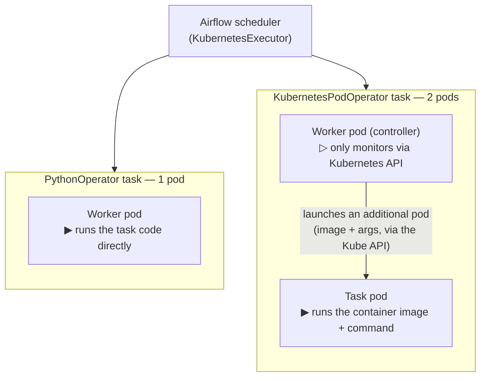
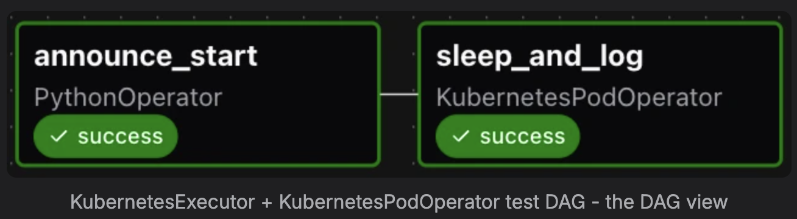
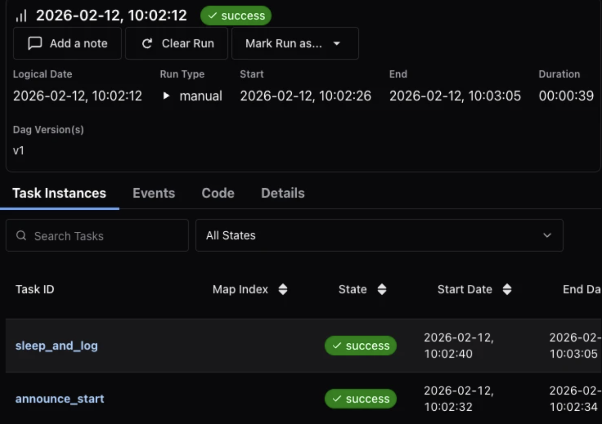
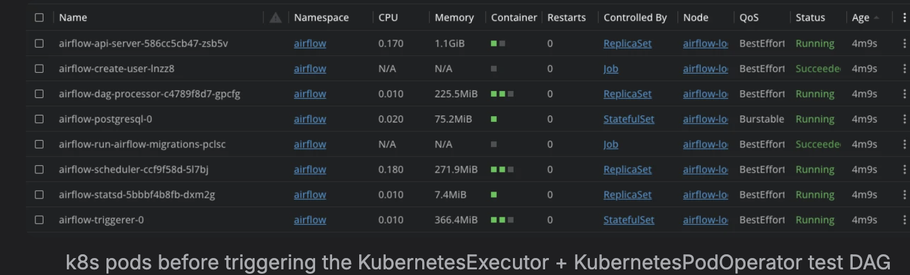
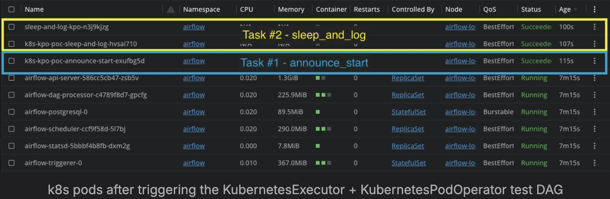

# 03 — KubernetesExecutor meets KubernetesPodOperator

Within the Kubernetes ecosystem it is common to configure Airflow with the **KubernetesExecutor**: the
platform then leverages Kubernetes-native scalability and cost efficiency — when no task runs, no
worker resource runs. To guarantee **task isolation** (dedicated dependencies, configuration, and
resources per pipeline), it is equally common to use the **KubernetesPodOperator (KPO)**.

In practice the two are used together, and understanding their interaction matters, because the
combination directly determines **how many pods each task creates**.

## Theory: two pods per KPO task

Two facts from the pinned provider docs (`apache-airflow-providers-cncf-kubernetes` **10.19.0** — the
exact version this repo installs via [`infra/values/airflow.yaml`](../../infra/values/airflow.yaml))
explain the result.

> "The Kubernetes executor runs each task instance in its own pod on a Kubernetes cluster."
> — [KubernetesExecutor, provider 10.19.0](https://airflow.apache.org/docs/apache-airflow-providers-cncf-kubernetes/10.19.0/kubernetes_executor.html)

So under the KubernetesExecutor, the scheduler creates **one worker pod per task**, regardless of the
operator the task uses.

> "The KubernetesPodOperator allows you to create and run Pods on a Kubernetes cluster. […] The
> KubernetesPodOperator uses the Kubernetes API to launch a pod in a Kubernetes cluster. By supplying
> an image URL and a command with optional arguments, the operator uses the Kube Python Client to
> generate a Kubernetes API request that dynamically launches those individual pods."
> — [KubernetesPodOperator, provider 10.19.0](https://airflow.apache.org/docs/apache-airflow-providers-cncf-kubernetes/10.19.0/operators.html#kubernetespodoperator)

So a KPO task **additionally** launches its own pod to run the specified container.

Put the two together — *"each task instance in its own pod"* (executor) plus *"dynamically launches
those individual pods"* (operator) — and a **single KPO task on a KubernetesExecutor cluster creates
two pods**:

| Pod | Created by | Role |
| --- | --- | --- |
| **Worker pod** | KubernetesExecutor | Acts as a controller — monitors the task pod's execution via the Kubernetes API and reports status back to the scheduler. |
| **Task pod** | KubernetesPodOperator | Runs the actual workload with its own image, dependencies, and resource configuration. |

By contrast, a task using **PythonOperator** (or any standard operator) on the same cluster produces
**only one pod** — the worker pod, which executes the task code directly.

## Experiment: verifying it locally

The theory was verified on a local Airflow cluster to make sure it holds in practice.

**Setup**

- macOS, Docker via Colima, Kubernetes via **kind** (Kubernetes-in-Docker) — a 100% local stack.
- Airflow with the **KubernetesExecutor**, deployed via the official Airflow Helm chart.
- Worker-pod **retention enabled** for both succeeded and failed pods
  (`delete_worker_pods: "False"`), so every pod stays visible after execution for inspection.

**DAG** — [`dags/k8s_kpo_poc.py`](../../dags/k8s_kpo_poc.py) chains two tasks: `announce_start`
(a **PythonOperator** doing an in-process print) and `sleep_and_log` (a **KubernetesPodOperator**
running `k8s-kpo-poc sleep --seconds 20` from the `k8s_kpo_poc:local` image).

*The test DAG: `announce_start` (PythonOperator) → `sleep_and_log` (KubernetesPodOperator).*

*The DAG run: manually triggered, ~39 s end to end, with both task instances
(`sleep_and_log`, `announce_start`) succeeded.*

**Result**

*Before* triggering the DAG, only the Airflow core-service pods are present (api-server,
dag-processor, scheduler, triggerer, statsd, postgresql, plus the one-off `create-user` and
`run-airflow-migrations` jobs):

*Before: only Airflow core-service pods.*

*After* a full run, **3 additional pods** appear — exactly as the theory predicts:

*After: 3 new pods — `announce_start` (PythonOperator) created 1, `sleep_and_log`
(KubernetesPodOperator) created 2.*

| Pod | Task | Created by | Role |
| --- | --- | --- | --- |
| `k8s-kpo-poc-announce-start-…` | `announce_start` — PythonOperator | KubernetesExecutor | Worker pod — runs the task code directly |
| `k8s-kpo-poc-sleep-and-log-…` | `sleep_and_log` — KubernetesPodOperator | KubernetesExecutor | Worker pod — controller; only monitors via the Kubernetes API |
| `sleep-and-log-kpo-…` | `sleep_and_log` — KubernetesPodOperator | KubernetesPodOperator | Task pod — runs the container workload |

So a full run produces **2 worker pods** (one per task, from the KubernetesExecutor) **+ 1 task pod**
(from the KPO) = **3 pods**. The `PythonOperator` task created a single pod; the
`KubernetesPodOperator` task created two — confirming the theory.

## Implications

With the default executor configuration, **all tasks share the same base image, dependencies, and
resource allocations**. That is enough to validate scheduling scalability, but it does not suit a
platform where workloads are heterogeneous: when many applications are maintained **independently by
different teams**, each with its own Python dependencies and resource profile (some CPU-intensive,
others memory-hungry), a single shared image becomes a bottleneck.

This is precisely the use case for the **KubernetesPodOperator**: full task isolation, where each
workload runs in its own container with its own specification. Application teams focus on building and
packaging their logic as standalone **CLI applications**, without touching Docker internals or Airflow
itself, while the orchestration layer only **wraps and schedules** those images. This is the
separation of concerns the root PoC demonstrates.

The trade-off is the extra pod per task shown above — acceptable when isolation is the requirement.

## Next step

Validate `executor_config` with `pod_override` to launch tasks with a **specific image** and **custom
resource requests** (CPU, memory) at the task level. The initial PoC covered only default DAG/task
configuration and focused on Airflow's ability to schedule a large number of tasks concurrently; the
per-task override path is the natural follow-up. See also
[04 — Executor & Operator strategy](04-executor-strategy.md) for the executor choice that removes the
second pod entirely.
