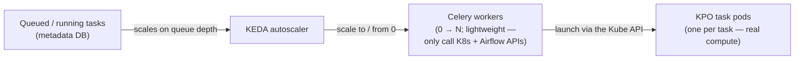

# 04 — Executor & Operator strategy

[The previous document](03-kubernetes-executor-meets-kpo.md) established the cost of pairing the
**KubernetesExecutor** with the **KubernetesPodOperator (KPO)**: two pods per KPO task. This document
covers the alternative that removes that overhead, how to scale it from zero, and the resulting
decision matrix.

## CeleryExecutor + KubernetesPodOperator

The KPO also runs under the **CeleryExecutor** — indeed this is the default setup on managed Airflow
platforms such as Astronomer. With this pairing, **the executor does not create a pod per task**; only
the KPO creates pods. Task isolation, scalability, and simplicity are all preserved, without the
second (worker/controller) pod.

The trade-off is infrastructure complexity: Celery needs a **message broker** (Redis or RabbitMQ) and
**permanently running Celery workers** — more moving parts to operate.

That said, in the **CeleryExecutor + KPO** pattern specifically, the Celery workers do very
lightweight work: they only make API calls to Kubernetes and Airflow. They need few resources, and a
**small number suffices** even for a large number of tasks — enough only to avoid a single point of
failure (SPOF).

## Scale from zero: CeleryExecutor + KEDA

[KEDA](https://airflow.apache.org/docs/helm-chart/1.22.0/keda.html) (Kubernetes Event-Driven
Autoscaler) adjusts the number of active Celery workers based on the number of tasks in `queued` or
`running` state.

> One advantage of KEDA is that it can scale the worker pool **to and from zero** — no workers sit
> idle when there are no tasks.

Combined with the lightweight nature of the workers in the KPO pattern, this yields a cost profile
close to the KubernetesExecutor (nothing runs when nothing is scheduled) while avoiding the
two-pods-per-task overhead.

## Decision matrix

For large-scale processing of short-lived tasks, with a good balance of latency and cost, three
combinations are worth considering:

| Combination | Pods per task | Task isolation | Notes |
| --- | --- | --- | --- |
| **KubernetesExecutor + Python/BashOperator** | 1 | ❌ shared image & resources | Simplest; good for uniform, native tasks. Validated scheduling scalability in the PoC. |
| **KubernetesExecutor + KPO** | 2 | ✅ full | Native scale-to-zero, but an extra controller pod per task. |
| **CeleryExecutor + KPO** | 1 (KPO only) | ✅ full | No per-task executor pod; needs a broker + always-on (but lightweight) workers. Scales from zero with KEDA. |

## Conclusion

When the workload requires **full isolation between tasks** — each application with its own
dependencies, its own interface (a CLI), its own secrets, and its own Docker image (sometimes with
specific system requirements) — the design points to a **KPO-based** architecture. The remaining
choice is the executor:

- **KubernetesExecutor + KPO** — fewer moving parts, at the cost of a second pod per task.
- **CeleryExecutor + KPO (+ KEDA)** — one pod per task and scale-from-zero, at the cost of a broker
  and a small permanent worker pool.

This PoC validates the **KubernetesExecutor + KPO** path end to end; the **CeleryExecutor + KPO +
KEDA** path is the recommended direction to evaluate next for production scale.
